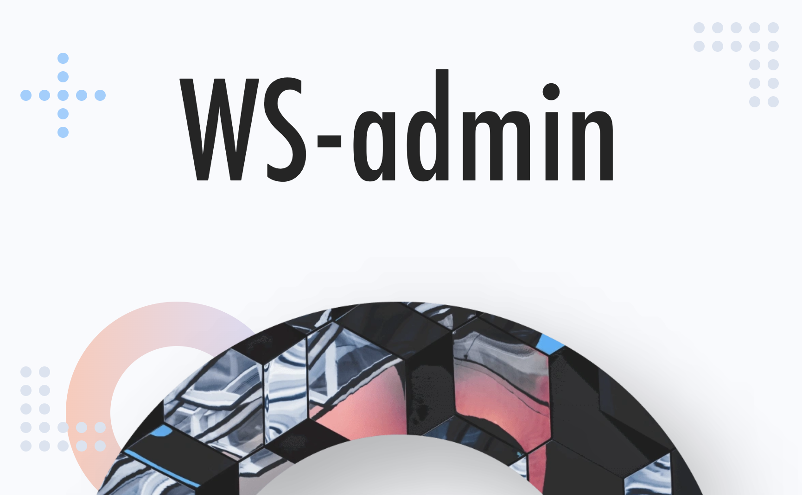

# Библиотека для автоматической генерации административных панелей в web.

## Запуск
Для запуска dev версии:

`npm start`
и
`npm run serve-production-proxy`
---

Для продакшн сборки:


`npm run build`

Файлы собранного фронта будет сохранены в папке `build` текущего проекта.

---
## Логика работы
Посредством интерфейса создаются статьи в интерактивном редакторе. 
В редакторе есть много опций для работы с текстом, изображениями и др.

После создания статьи появляется возможность получить её по АПИ в виде JSON-объекта.

## Редактор
Редактор - это стороняя библиотека ***ckeditor5*** с нашими надстройками поверх.
Плагины редактора как и сам редактор с его конфигом лежат в /src/primitives/Editor. 
Любая опция в тулбаре редактора это плагин, в основном используются те что из коробки, но также есть и кастомные.


## Пример конфигурации редактора:
```yaml
title: Тестирование административной панели WS
roles:
- admin
- guest
- user
- content-manager
permissions:
  allow:
  - "*"
  deny:
  - guest
sideMenu:
  dataSource:
    type: list
    options:
      data:
      - title: Список
        code: testList
        permissions:
          allow:
          - "*"
          deny:
          - guest
        to: "/list"
      - title: Вложенность
        code: inDeep
        permissions:
          allow:
          - "*"
          deny:
          - guest
        to: "/deep"
      - title: Детальная страница
        code: detail
        permissions:
          allow:
          - admin
          deny:
          - "*"
        to: "/detail/1"
screens:
- pageUrl: "/deep"
  title: Тестирование блоков
  blocks:
  - name: TestBlock1
    type: TestBlock
    dataSource:
      type: list
      options:
        data: test.name
    blocks:
    - name: TestBlock2
      type: TestBlock
      blocks: []
      actions:
        inc:
          type: redirect
          options:
            url: "/user/{{login}}"
      dataSource:
        type: list
        options:
          data: получилось???
        context1: test.name
- pageUrl: "/list"
  title: Тестирование административной панели WS
  blocks:
  - type: List
    permissions:
      allow:
      - "*"
      deny:
      - guest
    dataSource:
      type: list
      options:
        data:
          columns:
          - title: Name
            field: name
          - title: Surname
            field: surname
          - title: Birth Year
            field: birthYear
            type: numeric
          - title: Birth Place
            field: birthCity
            lookup:
              '34': İstanbul
              '63': Şanlıurfa
          data:
          - id: '11141'
            name: Mehmet
            surname: Baran
            birthYear: 1987
            birthCity: 63
          - name: Zerya Betül
            surname: Baran
            birthYear: 2017
            birthCity: 34
    actions:
      view:
        type: redirect
        options:
          url: "/user/{{login}}"
      delete:
        permissions:
          allow:
          - admin
          deny:
          - "*"
        type: api:request
        options:
          url: "/api/admin/user/delete"
          method: delete
          params:
            id: "{{id}}"
      create:
        permissions:
          allow:
          - "*"
          deny:
          - guest
        type: api:request
        options:
          url: "/api/admin/user/create"
          method: post
          params:
            id: "{{name}}"
      update:
        permissions:
          allow:
          - "*"
          deny:
          - guest
        type: redirect
        options:
          url: admin/user/update/{{id}}
    config:
      pagination:
        countOnPage: 20
- pageUrl: "/detail/:pageId"
  title: Детальная страница пользователя
  blocks:
  - type: DetailView
    dataSource:
      type: api
      options:
        url: "/api/admin/user/{{pageId}}"
      context: screen.user
    actions:
      delete:
        permissions:
          allow:
          - admin
          deny:
          - "*"
        type: api:request
        options:
          url: "/api/admin/user/delete"
          method: get
          params:
            id: "{{screen.user.id}}"
      update:
        permissions:
          allow:
          - "*"
          deny:
          - guest
        type: api:request
        options:
          url: "/api/admin/user/update"
          method: post
          params:
            id: "{{id}}"
    config:
      fields:
      - title: 'ФИО:'
        type: Input
        config:
          validations:
          - text
          - length > 3
        value: "{{screen.user.name}}"
      - title: 'ФИО1:'
        type: Input
        config:
          validations:
          - text
          - length > 3
        value: "{{name2}}"
      - title: 'Изображение профиля:'
        type: ImageViewer
        config:
          multiFiles: false
          validations:
          - type:jpg,png
          - sizeLessThen:10mb
        value: https://jssors8.azureedge.net/demos/image-slider/img/faded-monaco-scenery-evening-dark-picjumbo-com-image.jpg
      - title: 'Приглашен пользователем:'
        type: Dropdown
        value: "{{isInvitedBy}}"
        dataSource:
          alias: dpAllUsers
          type: api
          options:
            url: "/api/admin/users"
        config:
          suggests:
            dataSource:
              type: list
              options:
                data: "{{dpAllUsers}}"

```
